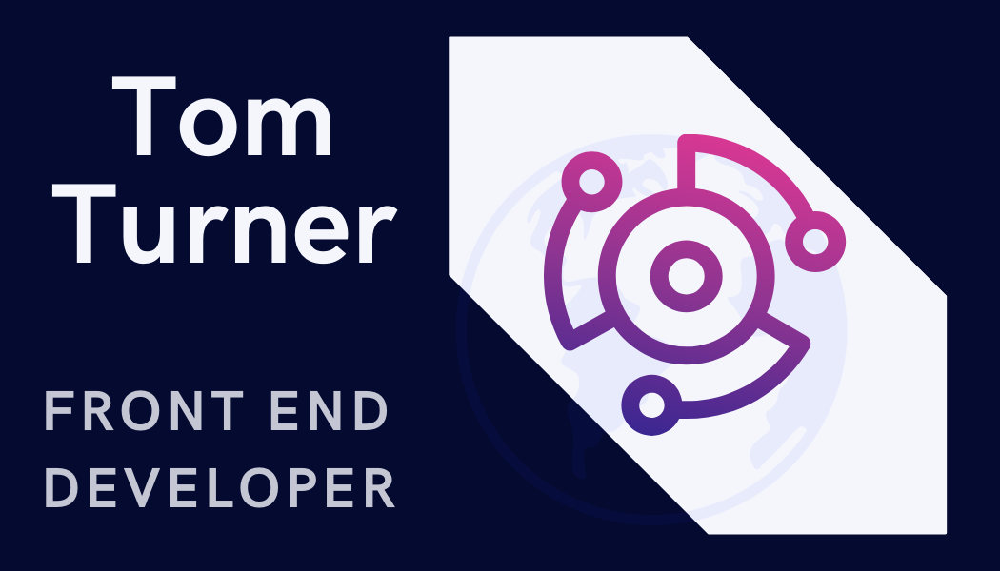

  

<h1 align="center">Hi there 👋, I'm Tom!</h1>

A front end developer from Leeds, UK.

I'm passionate about modern web design and I enjoy using the following technolgies; JavaScript, ReactJS, Tailwind CSS, I am always eager to learn and grow and I am currently improving my coding and full stack development skills through the CoGrammar webdevelopment bootcamp.

  
  

<h2 align="center">🛠️ Skills</h2>

 
  
  
  
  
  .
  
  

<h2 align="center">🔥 My GitHub Stats</h2>

  

<h2 align="center">🌟 Top Languages</h2>

  

<h2 align="center">🔥 My Streak Stats</h2>

<h2 align="center">⚡ Recent Activity</h2>
# Recent Activity :zap:
<!--START_SECTION:activity-->
<!--END_SECTION:activity-->
